<!--
  ================================================================
  Live at: github.com/MohammedAnas21/MohammedAnas21
  GitHub username is already set to MohammedAnas21 throughout.

  STILL OPEN — three href="#" placeholders need real links:
    1. LinkedIn URL   (2 spots: header + "Let's Connect")
    2. Portfolio URL  (1 spot: header)
  Search this file for href="#" to find them.

  Also check the 5 "Repository" badge links under Featured Projects —
  they point to repo names that don't exist yet
  (github.com/MohammedAnas21/ai-voice-receptionist, etc.). Your
  actual repos right now are: hospiq, Temptation, Portfolio,
  AI-Agent-Workspace. Point each link to the real repo once created,
  or tell me the mapping and I'll update it.

  Architecture + ER diagrams are now always visible (not collapsed)
  and the ER diagrams include field-level PK/FK detail, matching the
  reference screenshot. GitHub renders Mermaid natively — no image
  hosting needed.
  ================================================================
-->

<div align="center">


<code>&gt; ./whoami.sh</code>

<h3>Designing Intelligent Systems. Automating Real Workflows. Learning in Public.</h3>

<sub>AI Engineer with hands-on experience across <b>5 internships</b> spanning Generative AI, Agentic AI, RAG, and AI Voice Automation — currently building production-style multi-agent systems and shipping them as real projects, not just notebooks.</sub>

<br/><br/>

<a href="mailto:mohammedanas21102001@gmail.com"></a>
<a href="#"></a>
<a href="https://github.com/MohammedAnas21"></a>
<a href="#"></a>


<br/><br/>


</div>

<br/>

<div align="center">

| 🎓 | 🤖 | 📜 | 🛰️ | ♾️ |
|:---:|:---:|:---:|:---:|:---:|
| **5** | **5+** | **9+** | **2025** | **Learning.** |
| Internships Completed | AI/GenAI Projects Built | Certifications Earned | B.E. CSE Graduate | **Building. Shipping.** |

</div>

---

## 🧾 About Me

```yaml
name: "Mohammed Anas"
role: "AI Engineer"
experience: "5 internships"
specialization:
  - Generative AI
  - Agentic AI & Multi-Agent Systems
  - Voice AI & Conversational AI
  - RAG & Knowledge Systems
  - AI Automation & Orchestration
location: "Karnataka, India"
available_for: [Full-time, Contract, Freelance]
```

- 🔭 Currently building production-style **multi-agent systems, RAG pipelines, and AI voice agents**
- 🎙️ Productizing two builds — an **AI Voice Receptionist** and an **AI Lead Generation Workflow** — as services for SMBs in real estate, healthcare & e-commerce
- 💼 Open to **AI/GenAI Engineer roles** and **freelance/contract work** across India, UAE & US markets
- 💬 Ask me about RAG architectures, LangChain/LangGraph, or building voice agents with Twilio + Deepgram + ElevenLabs

## ⚡ What I Do

<table width="100%">
<tr>
<td width="33%" valign="top">

### 🎯 Design
Architect scalable AI systems and intelligent workflows end-to-end

</td>
<td width="33%" valign="top">

### 🛠️ Build
Ship production-ready GenAI apps, RAG pipelines & multi-agent systems

</td>
<td width="33%" valign="top">

### 🤖 Automate
Wire business workflows together with AI agents & n8n

</td>
</tr>
<tr>
<td width="33%" valign="top">

### 🔌 Integrate
Connect LLMs, voice stacks & databases through clean APIs

</td>
<td width="33%" valign="top">

### ⚡ Optimize
Tune performance, cost & reliability across the pipeline

</td>
<td width="33%" valign="top">

### 🚀 Deliver
Get things into production — not just notebooks

</td>
</tr>
</table>

---

## 🚀 Featured AI Projects

<div align="right">

[More projects on my repositories →](https://github.com/MohammedAnas21?tab=repositories)

</div>

Every project below ships with a full **system architecture** diagram and a **field-level ER / data model** diagram, rendered natively by GitHub via Mermaid.

<br/>

### 1️⃣ AI Voice Receptionist


`OpenAI` `Deepgram` `Twilio` `ElevenLabs` `FastAPI` `Webhooks`

Production AI automation system that handles customer calls end-to-end — real-time speech-to-text, LLM reasoning, and text-to-speech, wired into lead qualification and CRM-ready workflows.

- ✅ Real-time STT → LLM → TTS pipeline
- ✅ Automated appointment scheduling & lead qualification
- ✅ CRM-ready webhook integration
- ✅ Built for multi-tenant SMB deployment (real estate, healthcare, e-commerce)

[](https://github.com/MohammedAnas21/ai-voice-receptionist)

**🏗️ Architecture**

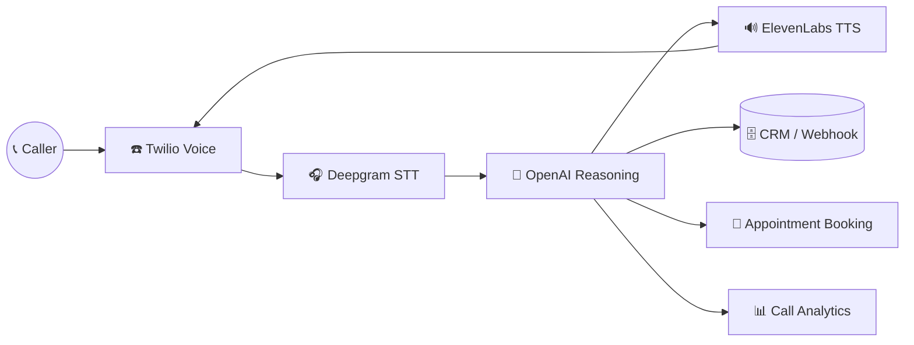

**🗂️ ER Diagram**

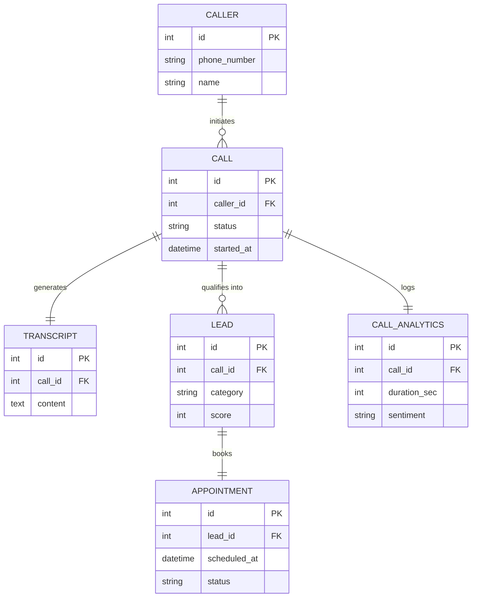

---

### 2️⃣ AI Lead Generation Workflow
`Python` `FastAPI` `LangChain` `PostgreSQL` `REST APIs` `Webhooks`

An AI-powered lead qualification and routing system that analyzes, scores, and prioritizes incoming leads, then automates CRM sync and personalized outreach.

- ✅ LLM-based lead analysis, categorization & scoring
- ✅ Automated CRM synchronization via REST APIs / webhooks
- ✅ Personalized outreach email generation
- ✅ Retry & error-handling for workflow monitoring

[](https://github.com/MohammedAnas21/ai-lead-generation-workflow)

**🏗️ Architecture**

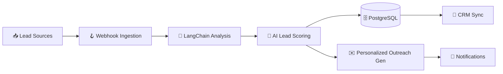

**🗂️ ER Diagram**

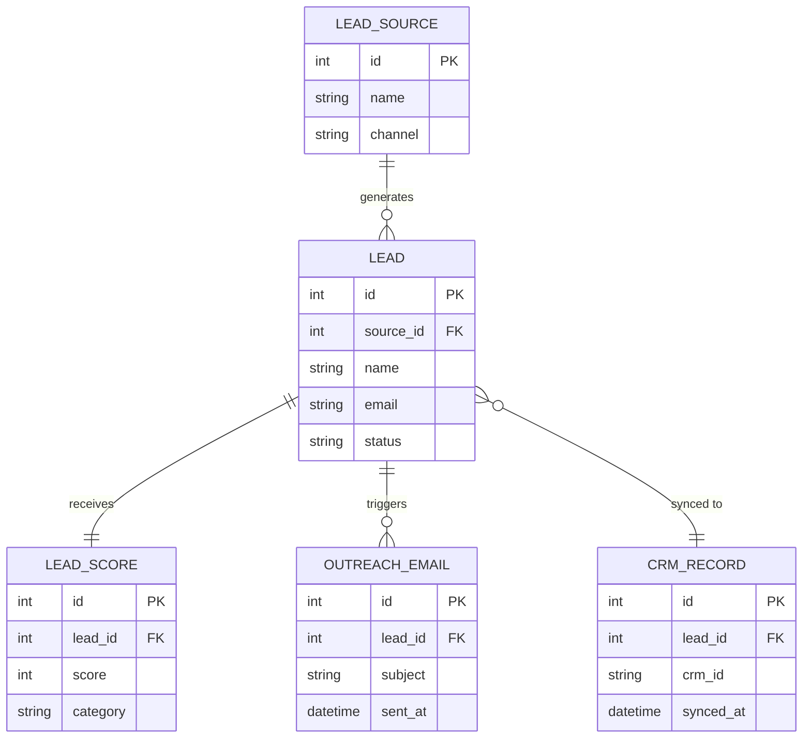

---

### 3️⃣ RAG Knowledge Assistant
`LangChain` `OpenAI` `ChromaDB` `FastAPI`

A Retrieval-Augmented Generation chatbot that answers questions from custom knowledge bases using semantic search and vector retrieval.

- ✅ Document ingestion & chunking pipeline
- ✅ Semantic search over a ChromaDB vector store
- ✅ Context-aware Q&A with source grounding
- ✅ Built for enterprise knowledge management

[](https://github.com/MohammedAnas21/rag-knowledge-assistant)

**🏗️ Architecture**

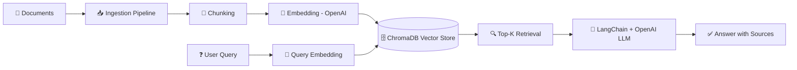

**🗂️ ER Diagram**

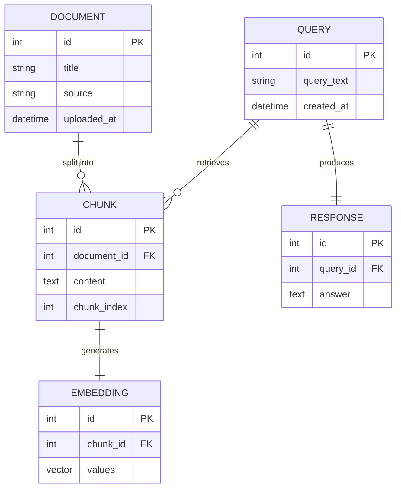

---

### 4️⃣ Multi-Agent Research Assistant
`Python` `LangGraph` `OpenAI` `FastAPI`

An autonomous multi-agent system that plans, researches, reasons, and generates structured reports — with agent collaboration orchestrated end-to-end.

- ✅ Planner → Researcher → Reasoning → Report agent pipeline
- ✅ Agent collaboration via LangGraph orchestration
- ✅ Scalable task delegation & information synthesis
- ✅ Structured, source-aware report output

[](https://github.com/MohammedAnas21/multi-agent-research-assistant)

**🏗️ Architecture**

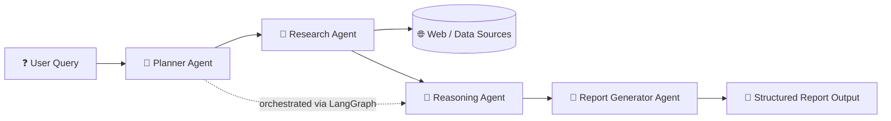

**🗂️ ER Diagram**

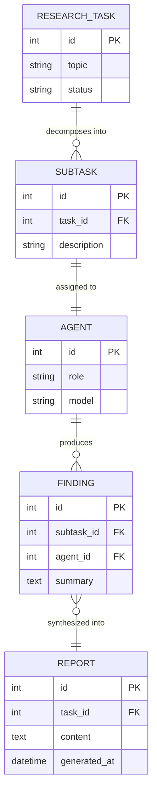

---

### 5️⃣ AI Resume Analyzer
`Python` `OpenAI API` `FastAPI`

An AI-powered resume analysis platform for ATS optimization, candidate evaluation, and skill-gap analysis against a target job description.

- ✅ LLM-based resume parsing & feature extraction
- ✅ ATS scoring engine with actionable recommendations
- ✅ Skill-gap analysis against job descriptions
- ✅ Automated resume-to-job matching

[](https://github.com/MohammedAnas21/ai-resume-analyzer)

**🏗️ Architecture**

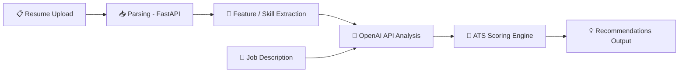

**🗂️ ER Diagram**

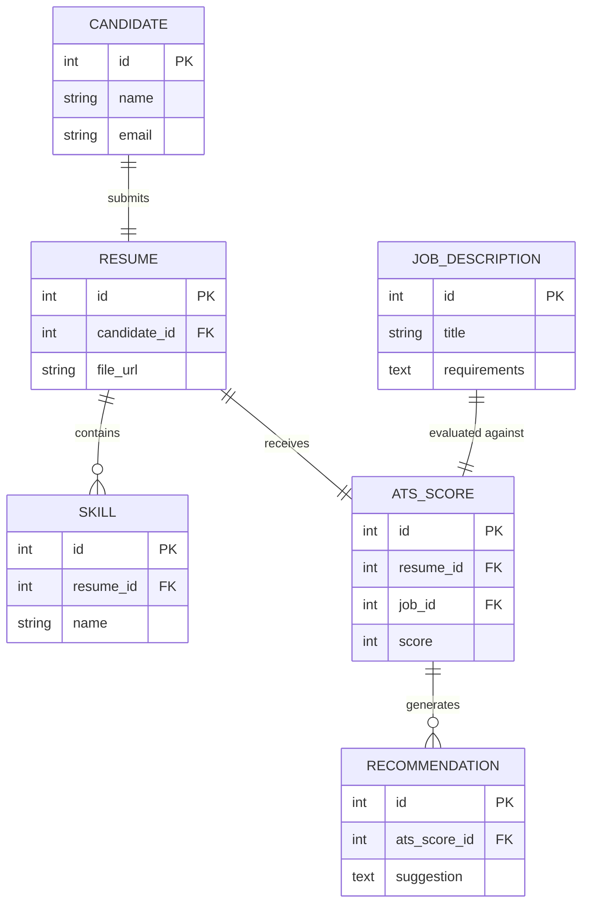

<div align="center">

[](https://github.com/MohammedAnas21?tab=repositories)

</div>

---

## 🧰 Tech Stack

<table width="100%">
<tr><th align="left">🧠 LLMs & Generative AI</th><td>


</td></tr>
<tr><th align="left">🎙️ Voice AI</th><td>


</td></tr>
<tr><th align="left">💻 Backend</th><td>


</td></tr>
<tr><th align="left">🗄️ Databases</th><td>


</td></tr>
<tr><th align="left">☁️ Cloud & DevOps</th><td>


</td></tr>
<tr><th align="left">🔧 Automation & Tools</th><td>


</td></tr>
</table>

---

## 🏗️ System Architecture & Design Philosophy

This is the general shape most of my AI systems follow — from voice receptionists to RAG assistants — regardless of the specific project:

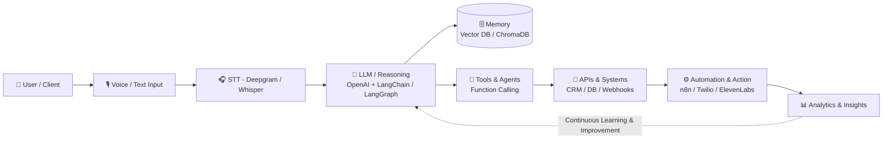

---

## 📈 GitHub Stats & Activity

<div align="center">


</div>

---

## 🤝 Let's Connect

I'm always open to discussing AI architecture, agentic systems, and freelance/contract opportunities — especially productizing AI voice agents and lead-gen workflows for SMBs in the **UAE and US markets**.

<div align="center">

<a href="#"></a>
<a href="mailto:mohammedanas21102001@gmail.com"></a>

</div>

<br/>

<div align="center">

> *"Great AI systems aren't just intelligent — they're reliable, scalable, and built with intention."*
> — Mohammed Anas

</div>


