<!--
  ================================================================
  Live at: github.com/MohammedAnas21/MohammedAnas21

  DESIGN SYSTEM — everything below pulls from one fixed palette so
  the whole profile reads as one designed surface instead of a wall
  of mismatched brand-colored badges:
    Indigo   #6366F1  (primary / core AI stack)
    Violet   #8B5CF6  (voice / agentic systems)
    Cyan     #06B6D4  (backend / infra)
    Blue     #3B82F6  (data layer)
    Slate    #1E293B  (cloud / devops)
    Fuchsia  #D946EF  (automation / tooling)
  Same palette drives: banner gradient, all badges, GitHub stats
  card accents, Mermaid diagram theme, and section dividers.

  LinkedIn, Portfolio, GitHub, Gmail links are all live.

  STILL OPEN — the 5 "Repository" badge links under Featured Projects
  point to repo names that don't exist yet. Your actual repos right
  now are: hospiq, Temptation, Portfolio, AI-Agent-Workspace. Tell me
  the mapping (which project = which repo) and I'll wire them in.

  Snake contribution animation workflow from before still applies —
  not repeated here, just referenced in its section.
  ================================================================
-->

<div align="center">


<br/>


<br/><br/>

<a href="mailto:mohammedanas21102001@gmail.com"></a>&nbsp;
<a href="https://www.linkedin.com/in/mohammed-anas21"></a>&nbsp;
<a href="https://github.com/MohammedAnas21"></a>&nbsp;
<a href="https://portfolio-pi-eight-wtb0pp2wf8.vercel.app/"></a>

<br/><br/>


</div>


<div align="center">


</div>


## 🧾 About Me

> [!NOTE]
> AI Engineer with hands-on experience across **5 internships** spanning Generative AI, Agentic AI, RAG, and Voice Automation — currently building production-style multi-agent systems and shipping them as real products, not notebooks.

```yaml
name: "Mohammed Anas"
role: "AI Engineer"
experience: "5 internships"
specialization:
  - Generative AI
  - Agentic AI & Multi-Agent Systems
  - Voice AI & Conversational AI
  - RAG & Knowledge Systems
  - AI Automation & Orchestration
location: "Karnataka, India"
available_for: [Full-time, Contract, Freelance]
```

- 🔭 Currently building production-style **multi-agent systems, RAG pipelines, and AI voice agents**
- 🎙️ Productizing two builds — an **AI Voice Receptionist** and an **AI Lead Generation Workflow** — for SMBs in real estate, healthcare & e-commerce
- 💼 Open to **AI/GenAI Engineer roles** and **freelance/contract work** across India, UAE & US markets
- 💬 Ask me about RAG architectures, LangChain/LangGraph, or voice agents built with Twilio + Deepgram + ElevenLabs


## ⚡ What I Do

<table width="100%">
<tr>
<td width="33%" valign="top" align="center">

**🎯 Design**
<br/>
<sub>Architect scalable AI systems and intelligent workflows end-to-end</sub>

</td>
<td width="33%" valign="top" align="center">

**🛠️ Build**
<br/>
<sub>Ship production-ready GenAI apps, RAG pipelines & multi-agent systems</sub>

</td>
<td width="33%" valign="top" align="center">

**🤖 Automate**
<br/>
<sub>Wire business workflows together with AI agents & n8n</sub>

</td>
</tr>
<tr>
<td width="33%" valign="top" align="center">

**🔌 Integrate**
<br/>
<sub>Connect LLMs, voice stacks & databases through clean APIs</sub>

</td>
<td width="33%" valign="top" align="center">

**⚡ Optimize**
<br/>
<sub>Tune performance, cost & reliability across the pipeline</sub>

</td>
<td width="33%" valign="top" align="center">

**🚀 Deliver**
<br/>
<sub>Get things into production — not just notebooks</sub>

</td>
</tr>
</table>


## 🚀 Featured AI Projects

<div align="right">

[More projects on my repositories →](https://github.com/MohammedAnas21?tab=repositories)

</div>

Every project ships with a full **system architecture** diagram and a **field-level ER / data model** diagram, themed and rendered natively by GitHub via Mermaid.

<br/>

### 1️⃣ AI Voice Receptionist


`OpenAI` `Deepgram` `Twilio` `ElevenLabs` `FastAPI` `Webhooks`

Production AI automation system that handles customer calls end-to-end — real-time speech-to-text, LLM reasoning, and text-to-speech, wired into lead qualification and CRM-ready workflows.

- ✅ Real-time STT → LLM → TTS pipeline
- ✅ Automated appointment scheduling & lead qualification
- ✅ CRM-ready webhook integration
- ✅ Built for multi-tenant SMB deployment (real estate, healthcare, e-commerce)

[](https://github.com/MohammedAnas21/ai-voice-receptionist)

<details open>
<summary><b>🏗️ Architecture</b></summary>

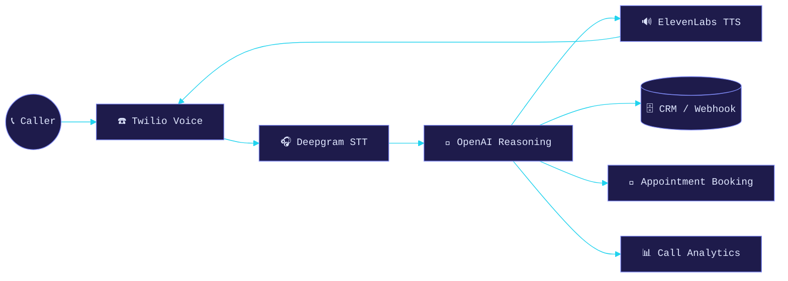

</details>

<details open>
<summary><b>🗂️ ER Diagram</b></summary>

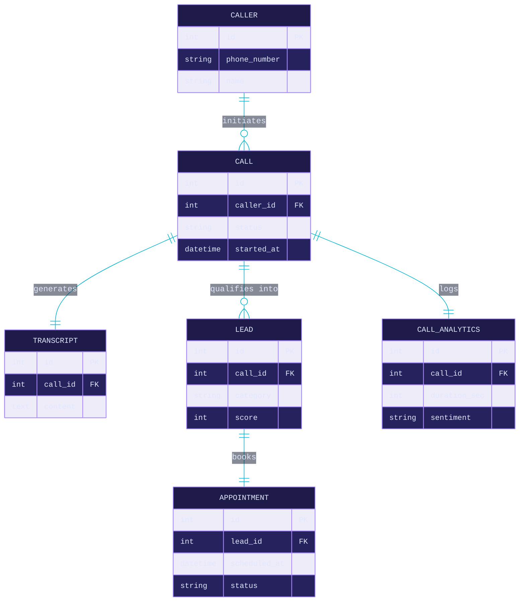

</details>

---

### 2️⃣ AI Lead Generation Workflow
`Python` `FastAPI` `LangChain` `PostgreSQL` `REST APIs` `Webhooks`

An AI-powered lead qualification and routing system that analyzes, scores, and prioritizes incoming leads, then automates CRM sync and personalized outreach.

- ✅ LLM-based lead analysis, categorization & scoring
- ✅ Automated CRM synchronization via REST APIs / webhooks
- ✅ Personalized outreach email generation
- ✅ Retry & error-handling for workflow monitoring

[](https://github.com/MohammedAnas21/ai-lead-generation-workflow)

<details open>
<summary><b>🏗️ Architecture</b></summary>

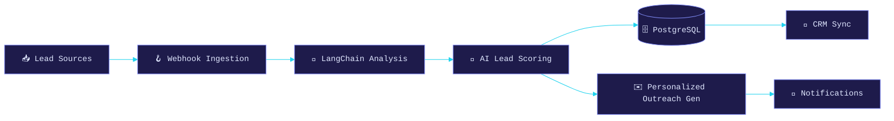

</details>

<details open>
<summary><b>🗂️ ER Diagram</b></summary>

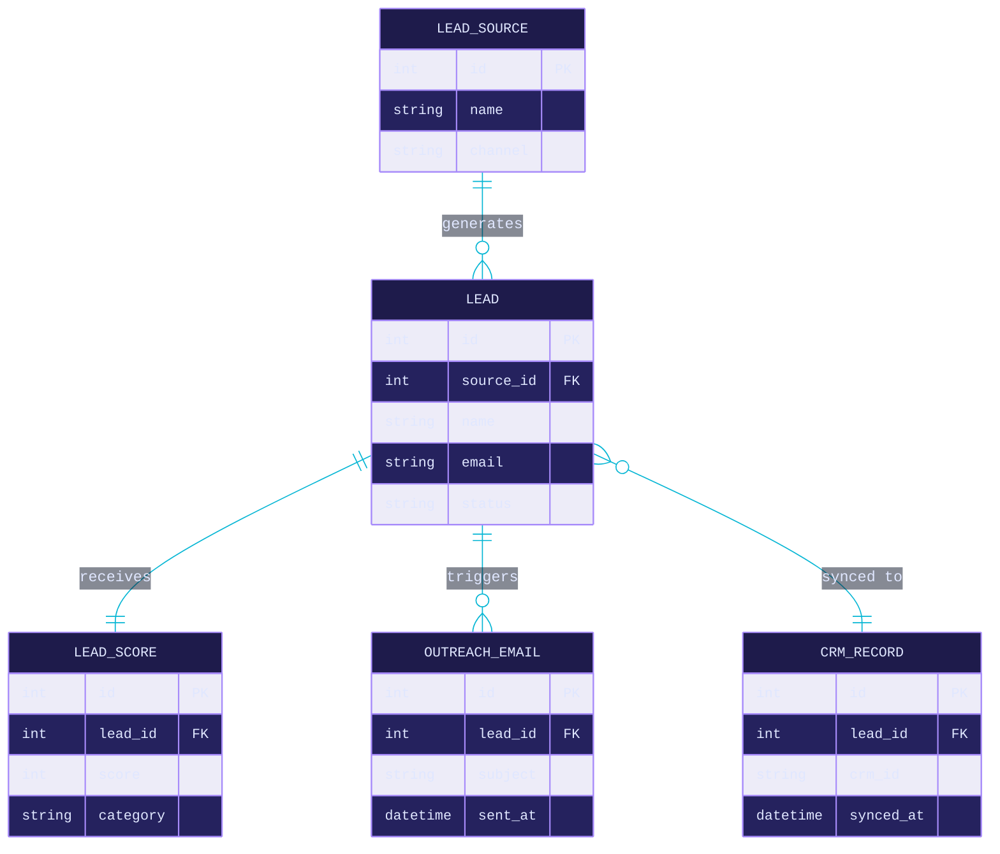

</details>

---

### 3️⃣ RAG Knowledge Assistant
`LangChain` `OpenAI` `ChromaDB` `FastAPI`

A Retrieval-Augmented Generation chatbot that answers questions from custom knowledge bases using semantic search and vector retrieval.

- ✅ Document ingestion & chunking pipeline
- ✅ Semantic search over a ChromaDB vector store
- ✅ Context-aware Q&A with source grounding
- ✅ Built for enterprise knowledge management

[](https://github.com/MohammedAnas21/rag-knowledge-assistant)

<details open>
<summary><b>🏗️ Architecture</b></summary>

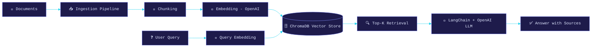

</details>

<details open>
<summary><b>🗂️ ER Diagram</b></summary>

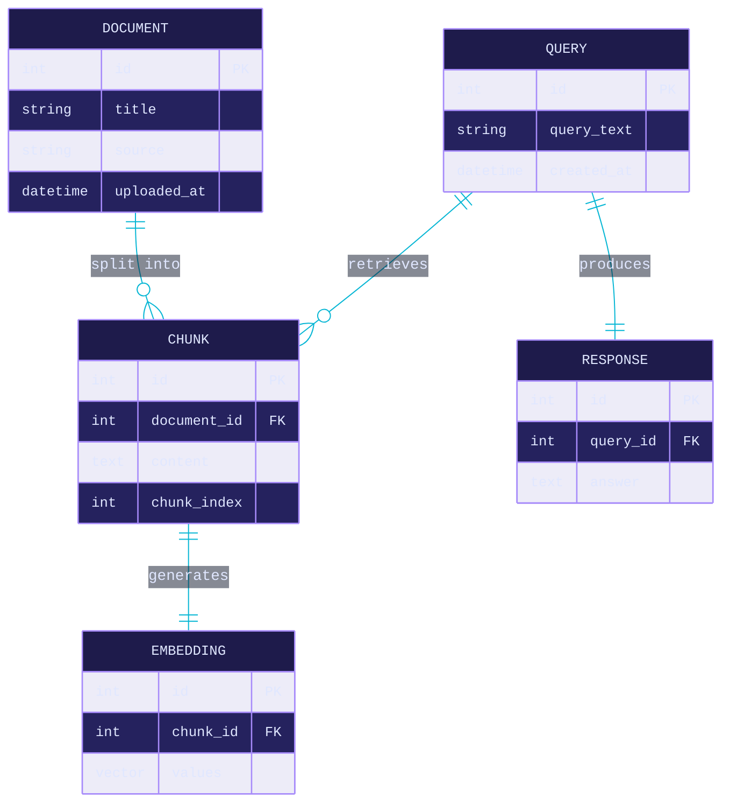

</details>

---

### 4️⃣ Multi-Agent Research Assistant
`Python` `LangGraph` `OpenAI` `FastAPI`

An autonomous multi-agent system that plans, researches, reasons, and generates structured reports — with agent collaboration orchestrated end-to-end.

- ✅ Planner → Researcher → Reasoning → Report agent pipeline
- ✅ Agent collaboration via LangGraph orchestration
- ✅ Scalable task delegation & information synthesis
- ✅ Structured, source-aware report output

[](https://github.com/MohammedAnas21/multi-agent-research-assistant)

<details open>
<summary><b>🏗️ Architecture</b></summary>

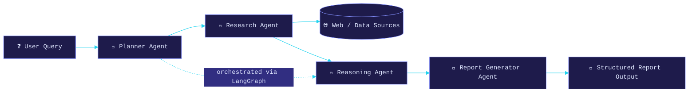

</details>

<details open>
<summary><b>🗂️ ER Diagram</b></summary>

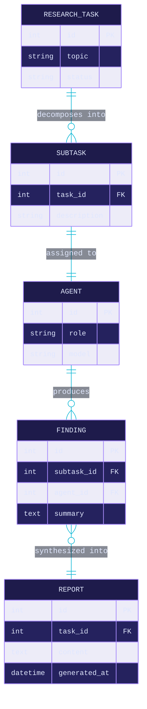

</details>

---

### 5️⃣ AI Resume Analyzer
`Python` `OpenAI API` `FastAPI`

An AI-powered resume analysis platform for ATS optimization, candidate evaluation, and skill-gap analysis against a target job description.

- ✅ LLM-based resume parsing & feature extraction
- ✅ ATS scoring engine with actionable recommendations
- ✅ Skill-gap analysis against job descriptions
- ✅ Automated resume-to-job matching

[](https://github.com/MohammedAnas21/ai-resume-analyzer)

<details open>
<summary><b>🏗️ Architecture</b></summary>

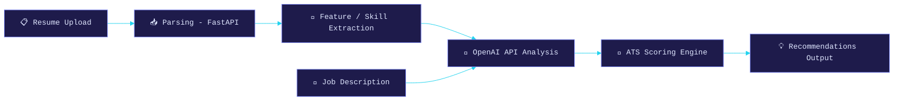

</details>

<details open>
<summary><b>🗂️ ER Diagram</b></summary>

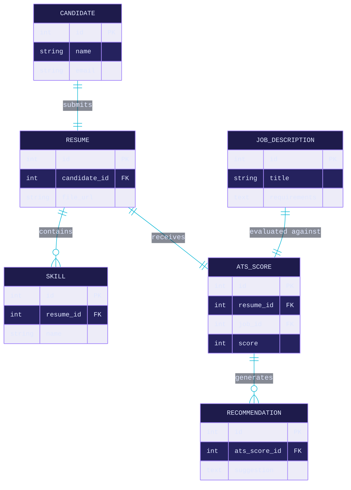

</details>

<div align="center">

[](https://github.com/MohammedAnas21?tab=repositories)

</div>


## 🧰 Tech Stack

<table width="100%">
<tr><th align="left" width="220">🧠 LLMs & Generative AI</th><td>


</td></tr>
<tr><th align="left">🎙️ Voice AI</th><td>


</td></tr>
<tr><th align="left">💻 Backend</th><td>


</td></tr>
<tr><th align="left">🗄️ Databases</th><td>


</td></tr>
<tr><th align="left">☁️ Cloud & DevOps</th><td>


</td></tr>
<tr><th align="left">🔧 Automation & Tools</th><td>


</td></tr>
</table>


## 🏗️ System Architecture & Design Philosophy

This is the general shape most of my AI systems follow — from voice receptionists to RAG assistants — regardless of the specific project:

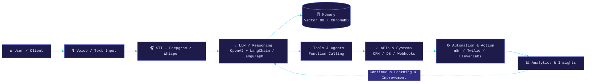


## 📈 GitHub Stats & Activity

<div align="center">


</div>


## 🐍 Contribution Snake

<div align="center">

<picture>
  <source media="(prefers-color-scheme: dark)" srcset="https://raw.githubusercontent.com/MohammedAnas21/MohammedAnas21/output/github-contribution-grid-snake-dark.svg"/>
  <source media="(prefers-color-scheme: light)" srcset="https://raw.githubusercontent.com/MohammedAnas21/MohammedAnas21/output/github-contribution-grid-snake.svg"/>
  
</picture>

<sub>Auto-generated daily from my contribution graph via GitHub Actions — see <code>.github/workflows/snake.yml</code></sub>

</div>


## 🤝 Let's Connect

> [!TIP]
> Always open to discussing AI architecture, agentic systems, and freelance/contract opportunities — especially productizing AI voice agents and lead-gen workflows for SMBs in the **UAE and US markets**.

<div align="center">

<a href="https://www.linkedin.com/in/mohammed-anas21"></a>&nbsp;
<a href="mailto:mohammedanas21102001@gmail.com"></a>&nbsp;
<a href="https://portfolio-pi-eight-wtb0pp2wf8.vercel.app/"></a>

</div>

<br/>

<div align="center">

> *"Great AI systems aren't just intelligent — they're reliable, scalable, and built with intention."*
> — Mohammed Anas

</div>


